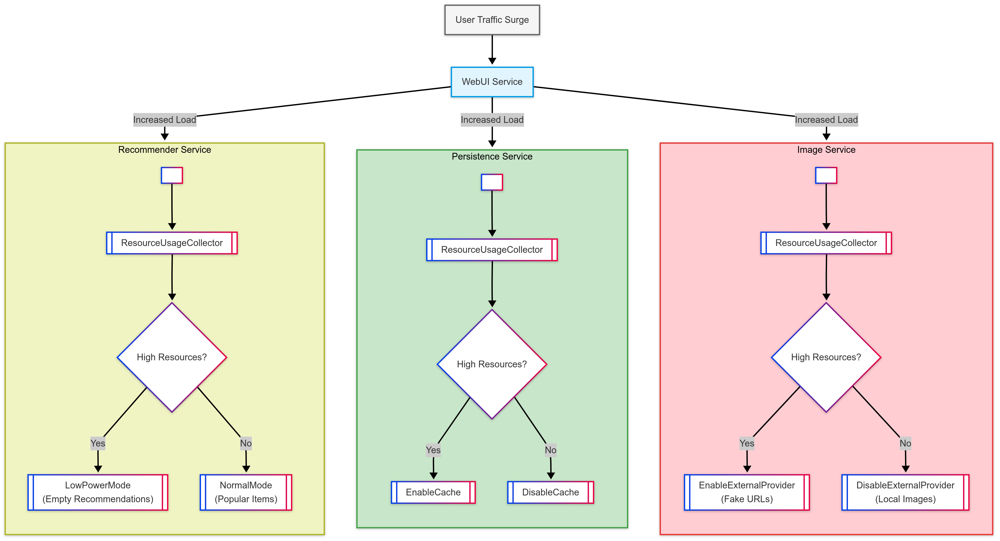

# Real-World Adaptation Scenario: Benin Traffic Increase

## Table of Contents
- [Scenario Overview](#scenario-overview)
- [Microservices Involved](#microservices-involved)
- [Metrics, Evaluators, and Adaptation Actions](#metrics-evaluators-and-adaptation-actions)
- [Code Implementation](#code-implementation)
---

## Scenario Overview
**Situation**: The system experiences a sudden but legitimate surge in user traffic to the WebUI service, exceeding normal operational thresholds. In resource-constrained environments where horizontal scaling is impossible (due to memory/disk limitations), the system must implement graceful degradation strategies.

**Adaptation Strategy**: The system responds through coordinated optimization measures:
1. **Recommender Service**: Switches to low-power recommendation algorithms
2. **Persistence Service**: Activates caching mechanisms
3. **Image Service**: Offloads image processing to external providers
4. **System-Wide**: Optimizes resource usage while maintaining core functionality

**Key Characteristics**:
- Traffic surge is non-malicious (valid user requests)
- Infrastructure scaling is not available
- Multi-service non coordinated adaptation



---

## Microservices Involved
| Service | Role | Observed Data           |
|---------|------|-------------------------|
| **WebUI** | Handles user requests and coordinates responses | No observations         |
| **Recommender** | Generates product recommendations | CPU usage, Memory usage |
| **Persistence** | Manages data storage operations | CPU usage, Memory usage |
| **Image** | Handles image processing and delivery | CPU usage, Memory usage |

---

### Metrics, Evaluators, and Adaptation Actions


### 1. Recommender Service
**Metrics Collectors**:
- `ResourceUsageCollector`: Monitors CPU/Memory consumption

**Condition Evaluator**:
- IncreaseResourceUsageEvaluator
```java
public class IncreaseResourceUsageEvaluator implements ConditionEvaluator<HashMap<String, Double>> {
    private final ThresholdProvider<Double> cpuThresholdProvider;
    private final ThresholdProvider<Double> memoryThresholdProvider;

    public IncreaseResourceUsageEvaluator(ThresholdProvider<Double> cpuThresholdProvider, ThresholdProvider<Double> memoryThresholdProvider) {
        this.cpuThresholdProvider = cpuThresholdProvider;
        this.memoryThresholdProvider = memoryThresholdProvider;
    }

    @Override
    public boolean test(HashMap<String, Double> metric) {
        return metric.get("cpu") != null
                && metric.get("memory") != null
                && (metric.get("cpu") > cpuThresholdProvider.getThreshold()
                || metric.get("memory") > memoryThresholdProvider.getThreshold());
    }
}
```

- DecreaseResourceUsageEvaluator
```java
public class DecreaseResourceUsageEvaluator implements ConditionEvaluator<HashMap<String, Double>> {
    private final ThresholdProvider<Double> cpuThresholdProvider;
    private final ThresholdProvider<Double> memoryThresholdProvider;

    public DecreaseResourceUsageEvaluator(ThresholdProvider<Double> cpuThresholdProvider, ThresholdProvider<Double> memoryThresholdProvider) {
        this.cpuThresholdProvider = cpuThresholdProvider;
        this.memoryThresholdProvider = memoryThresholdProvider;
    }

    @Override
    public boolean test(HashMap<String, Double> metric) {
        return metric.get("cpu") != null
                && metric.get("memory") != null
                && (metric.get("cpu") <= cpuThresholdProvider.getThreshold()
                || metric.get("memory") <= memoryThresholdProvider.getThreshold());
    }
}
```

**Adaptation Actions**:

| Action         | Description                         |
|----------------|-------------------------------------|
| `LowPowerMode` | return an empty items list          |
| `NormalMode`   | Uses precomputed popular items list |

### 2. Persistence Service
**Metrics Collectors**:
- `ResourceUsageCollector`: Monitors CPU/Memory consumption

**Condition Evaluator**:
``ResourceUsageEvaluator``


**Adaptation Actions**:

| Action | Description |
|--------|-------------|
| `DisableCache`                      | Disables caching to reduce dependency on the failing database.                                                                                                               |
| `EnableCache`                       | Enable caching to restore normal behavior.                                                                                                                                   |

### 4. Image Service
**Metrics Collectors**:
- `ResourceUsageCollector`: Monitors CPU/Memory consumption

**Condition Evaluator**:
``ResourceUsageEvaluator``

**Adaptation Actions**:

| Action                         | Description |
|--------------------------------|-------------|
| `EnableExternalImageProvider`  | Uses fake cloud image URLs |
| `DisableExternalImageProvider` | Switch back to local service using real image |

---

Here's the complete Code Implementation section for the Benign Traffic scenario:


## Code Implementation

### Adaptation Logic Architecture
The system implements independent but parallel adaptation mechanisms across affected services. Each service monitors its own resource usage and triggers localized adaptations without centralized coordination.

### Image Service Implementation
```java
public void beninTrafficObservation() {
    // 1. Define adaptation actions for traffic changes
    List<IAdaptationAction> trafficIncreaseActionList = List.of(new EnableExternalImageProvider());
    List<IAdaptationAction> trafficDecreaseActionList = List.of(new DisableExternalImageProvider());

    // 2. Create event subscribers with associated actions
    List<Observer<HashMap<String, Double>>> trafficIncreaseEventSubscriberList = 
        List.of(new EventSubscriber<>(trafficIncreaseActionList));
    List<Observer<HashMap<String, Double>>> trafficDecreaseEventSubscriberList = 
        List.of(new EventSubscriber<>(trafficDecreaseActionList));

    // 3. Initialize metrics collector for resource monitoring
    IMetricsCollector<HashMap<String, Double>> collector = new ResourceUsageCollector();

    // 4. Configure conditional events with threshold evaluators
    ConditionalEvent<HashMap<String, Double>> trafficIncreaseEvent = 
        new ConditionalEvent<>(collector, new IncreaseResourceUsageEvaluator(
            () -> 75.0,  // CPU threshold
            () -> 80.0   // Memory threshold
        ));
        
    ConditionalEvent<HashMap<String, Double>> trafficDecreaseEvent = 
        new ConditionalEvent<>(collector, new DecreaseResourceUsageEvaluator(
            () -> 60.0,  // CPU threshold 
            () -> 60.0   // Memory threshold
        ));

    // 5. Subscribe actions to events
    trafficIncreaseEvent.subscribeAll(trafficIncreaseEventSubscriberList);
    trafficDecreaseEvent.subscribeAll(trafficDecreaseEventSubscriberList);

    // 6. Start continuous monitoring
    var eventSubscription = new ContinuousObservationScheduler(
        List.of(trafficIncreaseEvent, trafficDecreaseEvent), 
        EVENT_LISTENING_INTERVAL_MS
    );
    eventSubscription.start();
}
```

### Persistence Service Implementation
```java
public void beninTrafficObservation() {
    // Adaptation actions for cache management
    List<IAdaptationAction> trafficIncreaseActionList = List.of(new EnableCache());
    List<IAdaptationAction> trafficDecreaseActionList = List.of(new DisableCache());

    // Event subscribers configuration
    List<Observer<HashMap<String, Double>>> trafficIncreaseEventSubscriberList = 
        List.of(new EventSubscriber<>(trafficIncreaseActionList));
    List<Observer<HashMap<String, Double>>> trafficDecreaseEventSubscriberList = 
        List.of(new EventSubscriber<>(trafficDecreaseActionList));

    // Shared resource metrics collector
    IMetricsCollector<HashMap<String, Double>> collector = new ResourceUsageCollector();

    // Threshold-based conditional events
    ConditionalEvent<HashMap<String, Double>> trafficIncreaseEvent = 
        new ConditionalEvent<>(collector, new IncreaseResourceUsageEvaluator(
            () -> 75.0,  // CPU threshold
            () -> 80.0   // Memory threshold
        ));
        
    ConditionalEvent<HashMap<String, Double>> trafficDecreaseEvent = 
        new ConditionalEvent<>(collector, new DecreaseResourceUsageEvaluator(
            () -> 60.0,  // CPU threshold
            () -> 60.0   // Memory threshold
        ));

    // Event-action binding
    trafficIncreaseEvent.subscribeAll(trafficIncreaseEventSubscriberList);
    trafficDecreaseEvent.subscribeAll(trafficDecreaseEventSubscriberList);

    // Start monitoring cycle
    new ContinuousObservationScheduler(
        List.of(trafficIncreaseEvent, trafficDecreaseEvent), 
        EVENT_LISTENING_INTERVAL_MS
    ).start();
}
```

### Recommender Service Implementation
```java
public void beninTrafficObservation() {
    // Define recommendation mode adaptations
    List<IAdaptationAction> trafficIncreaseActionList = List.of(new LowPowerMode());
    List<IAdaptationAction> trafficDecreaseActionList = List.of(new NormalMode());

    // Set up event subscribers
    List<Observer<HashMap<String, Double>>> trafficIncreaseEventSubscriberList = 
        List.of(new EventSubscriber<>(trafficIncreaseActionList));
    List<Observer<HashMap<String, Double>>> trafficDecreaseEventSubscriberList = 
        List.of(new EventSubscriber<>(trafficDecreaseActionList));

    // Resource monitoring setup
    IMetricsCollector<HashMap<String, Double>> collector = new ResourceUsageCollector();

    // Threshold configuration
    ConditionalEvent<HashMap<String, Double>> trafficIncreaseEvent = 
        new ConditionalEvent<>(collector, new IncreaseResourceUsageEvaluator(
            () -> 75.0,  // CPU threshold
            () -> 80.0   // Memory threshold
        ));
        
    ConditionalEvent<HashMap<String, Double>> trafficDecreaseEvent = 
        new ConditionalEvent<>(collector, new DecreaseResourceUsageEvaluator(
            () -> 60.0,  // CPU threshold
            () -> 60.0   // Memory threshold
        ));

    // Link events to actions
    trafficIncreaseEvent.subscribeAll(trafficIncreaseEventSubscriberList);
    trafficDecreaseEvent.subscribeAll(trafficDecreaseEventSubscriberList);

    // Initiate continuous monitoring
    new ContinuousObservationScheduler(
        List.of(trafficIncreaseEvent, trafficDecreaseEvent),
        EVENT_LISTENING_INTERVAL_MS
    ).start();
}
```

### Implementation Notes

1. **Threshold Configuration**:
   ```java
   // Threshold values can be adjusted per service needs
   new IncreaseResourceUsageEvaluator(
       () -> 75.0,  // CPU% threshold
       () -> 80.0    // Memory% threshold
   )
   ```

2. **Adaptation Coordination**:
   - Services adapt independently based on local resource metrics
   - No inter-service communication during adaptation
   - Parallel but uncoordinated optimization strategies

3. **Monitoring Interval**:
   ```java
   // Defined as class constant
   private static final int EVENT_LISTENING_INTERVAL_MS = 5000;  // 5-second checks
   ```

4. **Resource Metrics Structure**:
   ```java
   // HashMap contains these keys:
   Map<String, Double> metrics = Map.of(
       "cpu_usage", 85.3,    // Percentage
       "memory_usage", 78.1 // Percentage
   );
   ```
   The request rate can be also use for more detailed implementations but is not relly necessary for this workflow.
