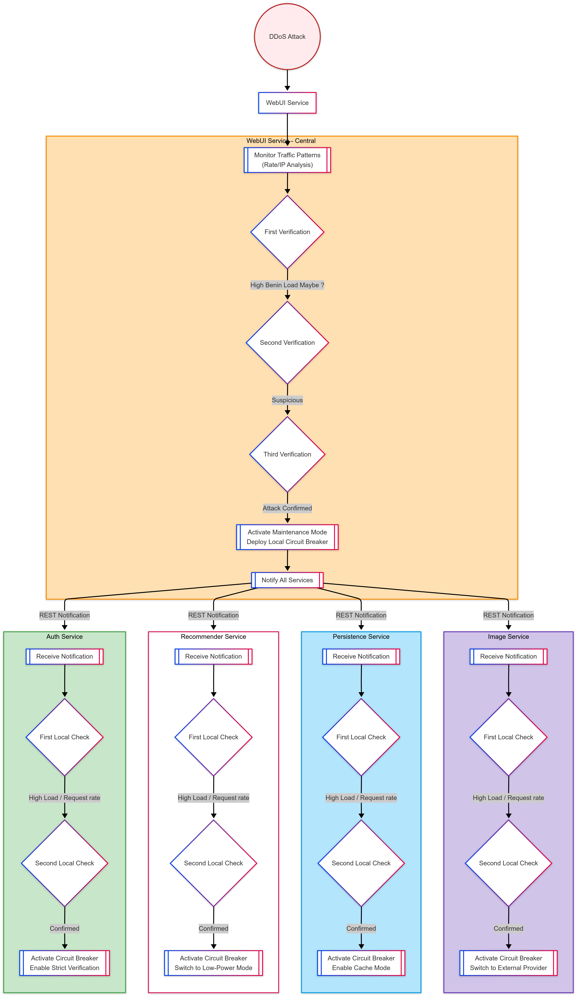

# Real-World Adaptation Scenario: Malicious Traffic Increase

## Table of Contents
- [Scenario Overview](#scenario-overview)
- [Microservices Involved](#microservices-involved)
- [Metrics, Evaluators, and Adaptation Actions](#metrics-evaluators-and-adaptation-actions)
- [Code Implementation](#code-implementation)
---


## Scenario Overview
**Situation**: The system faces a Distributed Denial-of-Service (DDoS) attack targeting the WebUI service, characterized by abnormally high traffic volumes from suspicious sources. The adaptive response must balance system protection with maintained core functionality.

**Adaptation Strategy**: A multi-stage defensive protocol activates through semi-coordinated actions:
1. **WebUI**: Implements triple-verified attack detection and initiates system-wide protections
2. **Auth Service**: Activates circuit breaker
3. **Recommender**: Switches to resource-efficient operations, circuit breaker
4. **Persistence**: Implements fail-safe caching mechanisms, activate circuit breaker
5. **Image-Service**: Activate circuit breaker, use external provider 

**Critical Process Flow**:
1. **Detection & Verification**
   - WebUI monitors request patterns (rate/IP analysis)
   - Triggers adaptation only after **3 consecutive confirmations**

2. **Primary Adaptations**
   - Activates maintenance mode interface
   - Deploys inter-service circuit breaker
   - Broadcasts attack event via REST notifications

3. **Service-Level Response**
   - Recipient services perform dual verification:
      - Confirm local attack indicators twice 
      - Execute service-specific protections:
         - Auth: circuit breaker, 
         - Recommender: Circuit breaker, Low-power recommendations
         - Persistence: Circuit breaker, Cache operations
         - Image: Circuit breaker, External provider

**Key Characteristics**:
- Multi-layer verification (3-tier central + 2-tier local)
- Cascading protection activation sequence
- State-aware circuit breaker deployment
- Autonomous but semi-coordinated service adaptations



---

## Microservices Involved
| Service         | Role                              | Observed Data |
|-----------------|-----------------------------------|---------------|
| **WebUI**       | Traffic analysis and coordination | Request rate, IP patterns |
| **Auth**        | Authentication management         | Request rate, IP patterns |
| **Recommender** | Content recommendations           | Request rate, IP patterns |
| **Persistence** | Data storage operations           | Request rate, IP patterns |
| **Image**       | Image provider                    | Request rate, IP patterns |

---

## Metrics, Evaluators, and Adaptation Actions

### 1. WebUI Service
**Metrics Collectors**:
- `LocalRequestMetricsCollector`: Tracks request frequency, error rate, total requests time, IP distributions etc

**Condition Evaluator**:
- `DDoSEvaluator` a simplify evaluator based on the request rate per seconds to identify a DDoS attack. You can add additional verifications using requests details.
```java
public class DDoSEvaluator implements ConditionEvaluator<ServiceMetrics> {
   private final ThresholdProvider<Double> rateThresholdProvider;
   private final long timeWindowMillis;

   public DDoSEvaluator(ThresholdProvider<Double> rateThresholdProvider, long timeWindowMillis) {
      this.rateThresholdProvider = rateThresholdProvider;
      this.timeWindowMillis = timeWindowMillis;
   }

   @Override
   public boolean test(ServiceMetrics metrics) {
      return metrics != null && metrics.getRequestRatePerSecond(timeWindowMillis) > rateThresholdProvider.getThreshold();
   }
}
```

- `NonDDoSEvaluator` a simplify evaluator based on the request rate per seconds to identify a benin traffic. You can add additional verifications using requests details.
```java
public class NonDDoSEvaluator implements ConditionEvaluator<ServiceMetrics> {
   private final ThresholdProvider<Double> rateThresholdProvider;
   private final long timeWindowMillis;

   public NonDDoSEvaluator(ThresholdProvider<Double> rateThresholdProvider, long timeWindowMillis) {
      this.rateThresholdProvider = rateThresholdProvider;
      this.timeWindowMillis = timeWindowMillis;
   }

   @Override
   public boolean test(ServiceMetrics metrics) {
      return metrics != null && metrics.getRequestRatePerSecond(timeWindowMillis) <= rateThresholdProvider.getThreshold();
   }
}
```

**Adaptation Actions**:

| Action                     | Description                                                                         |
|----------------------------|-------------------------------------------------------------------------------------|
| `EnableMaintenanceMode`    | Displays a maintenance page                                                         |
| `DisableMaintenanceMode`   | Remove the maintenance page                                                         |
| `OpenCircuitBreaker`       | Block all incoming requests except adaptation requests and maintenance servlet page |
| `CloseCircuitBreaker`      | Enable incoming requests                                                            |
| `DDoSAttackEventBroadcast` | Broadcasts attack event to all services                                             |

### 2. Auth Service
**Metrics Collectors**:
- `LocalRequestMetricsCollector`: Tracks request frequency, error rate, total requests time, IP distributions etc

**Condition Evaluator**:
- `DDoSEvaluator`
- `NonDDoSEvaluator`

**Adaptation Actions**:

| Action | Description |
|--------|-------------|
| `OpenCircuitBreaker`       | Block all incoming requests except adaptation requests and maintenance servlet page |
| `CloseCircuitBreaker`      | Enable incoming requests                                                            |

### 3. Recommender Service
**Metrics Collectors**:
- `LocalRequestMetricsCollector`: Tracks request frequency, error rate, total requests time, IP distributions etc

**Condition Evaluator**:
- `DDoSEvaluator`
- `NonDDoSEvaluator`

**Adaptation Actions**:

| Action         | Description                                                                     |
|----------------|---------------------------------------------------------------------------------|
| `OpenCircuitBreaker`       | Block all incoming requests except adaptation requests and maintenance servlet page |
| `CloseCircuitBreaker`      | Enable incoming requests                                                            |
| `LowPowerMode` | Disable recommendations                                                         |
| `NormalMode`   | Serve precomputed list of popular products                                      |

### 4. Persistence Service
**Metrics Collectors**:
- `LocalRequestMetricsCollector`: Tracks request frequency, error rate, total requests time, IP distributions etc

**Condition Evaluator**:
- `DDoSEvaluator`
- `NonDDoSEvaluator`

**Adaptation Actions**:

| Action | Description |
|--------|-------------|
| `OpenCircuitBreaker`       | Block all incoming requests except adaptation requests and maintenance servlet page |
| `CloseCircuitBreaker`      | Enable incoming requests                                                            |
| `DisableCache`                      | Disables caching to reduce dependency on the failing database.|
| `EnableCache`                       | Enable caching to restore normal behavior. |

### 5. Image Service
**Metrics Collectors**:
- `LocalRequestMetricsCollector`: Tracks request frequency, error rate, total requests time, IP distributions etc

**Condition Evaluator**:
- `DDoSEvaluator`
- `NonDDoSEvaluator`

**Adaptation Actions**:

| Action | Description |
|--------|-------------|
| `OpenCircuitBreaker`       | Block all incoming requests except adaptation requests and maintenance servlet page |
| `CloseCircuitBreaker`      | Enable incoming requests                                                            |
| `EnableExternalImageProvider`  | Uses fake cloud image URLs |
| `DisableExternalImageProvider` | Switch back to local service using real image |

---

## Code Implementation

> **Implementation Strategy**:  
> The code follows an event-driven architecture with semi-coordinated adaptation across services. Key components include:
> - **Conditional Events**: Monitor metrics using evaluators
> - **Multi-Verification Subscribers (EvenCounterSubscriber)**: Require consecutive confirmations before triggering actions
> - **Cascading REST Notifications**: WebUI broadcasts alerts to downstream services

---

### WebUI Service Implementation
```java
public void maliciousTrafficObservation() {
   List<IAdaptationAction> maliciousTrafficActionList = List.of(new DDoSAttackEventBroadcast(), new EnableMaintenanceMode(), new OpenCircuitBreaker());
   List<IAdaptationAction> beninTrafficActionList = List.of(new CloseCircuitBreaker(), new DisableMaintenanceMode());

   List<Observer<ServiceMetrics>> maliciousTrafficEventSubscriberList = List.of(new EventCounterSubscriber<>(maliciousTrafficActionList, 3));
   List<Observer<ServiceMetrics>> beninTrafficEventSubscriberList = List.of(new EventSubscriber<>(beninTrafficActionList));

   IMetricsCollector<ServiceMetrics> collector = new LocalRequestMetricsCollector();

   ConditionalEvent<ServiceMetrics> maliciousTrafficEvent = new ConditionalEvent<>(collector, new DDoSEvaluator(() -> 300.0, 60000));
   ConditionalEvent<ServiceMetrics> beninTrafficEvent = new ConditionalEvent<>(collector, new NonDDoSEvaluator(() -> 300.0, 60000));

   maliciousTrafficEvent.subscribeAll(maliciousTrafficEventSubscriberList);
   beninTrafficEvent.subscribeAll(beninTrafficEventSubscriberList);

   var eventSubscription = new ContinuousObservationScheduler(List.of(maliciousTrafficEvent, beninTrafficEvent), EVENT_LISTENING_INTERVAL_MS);

   eventSubscription.start();
}
```

> **Key Logic**:
> - Uses `EventCounterSubscriber(..., 3)` to enforce triple verification
> - Broadcasts attack alerts via `DDoSAttackEventBroadcast` REST operation
> - Cascading effect: Triggers maintenance mode + circuit breakers

---

### Recipient Services Implementation (Auth/Recommender/Persistence/Image)
```java
// Example: Recommender Service
public class MonitorMaliciousTraffic implements IAdaptationAction {
   private static final Logger LOG = LoggerFactory.getLogger(MonitorMaliciousTraffic.class);
   public static final int EVENT_LISTENING_INTERVAL_MS = 5000;

   @Override
   public void perform() {
      ServletContext context = ServletContextHolder.getContext();
      Boolean isMonitorEnabled = false;
      if (context != null) {
         isMonitorEnabled = (Boolean) context.getAttribute("isMonitoringMaliciousTraffic");
      }
      if (isMonitorEnabled != null  && isMonitorEnabled) {
         LOG.info("Action already performed :: Recommender is monitoring malicious traffic");
         return;
      }
      context.setAttribute("isMonitoringMaliciousTraffic", true);
      this.maliciousTrafficObservation();
      LOG.info("Action performed :: Recommender start monitoring malicious traffic");
   }

   public void maliciousTrafficObservation() {
      List<IAdaptationAction> maliciousTrafficActionList = List.of(new LowPowerMode(), new OpenCircuitBreaker());
      List<IAdaptationAction> beninTrafficActionList = List.of(new CloseCircuitBreaker(), new NormalMode());

      List<Observer<ServiceMetrics>> maliciousTrafficEventSubscriberList = List.of(new EventCounterSubscriber<>(maliciousTrafficActionList, 2));
      List<Observer<ServiceMetrics>> beninTrafficEventSubscriberList = List.of(new EventSubscriber<>(beninTrafficActionList));

      IMetricsCollector<ServiceMetrics> collector = new LocalRequestMetricsCollector();

      ConditionalEvent<ServiceMetrics> maliciousTrafficEvent = new ConditionalEvent<>(collector, new DDoSEvaluator(() -> 300.0, 60000));
      ConditionalEvent<ServiceMetrics> beninTrafficEvent = new ConditionalEvent<>(collector, new NonDDoSEvaluator(() -> 300.0, 60000));

      maliciousTrafficEvent.subscribeAll(maliciousTrafficEventSubscriberList);
      beninTrafficEvent.subscribeAll(beninTrafficEventSubscriberList);

      var eventSubscription = new ContinuousObservationScheduler(List.of(maliciousTrafficEvent, beninTrafficEvent), EVENT_LISTENING_INTERVAL_MS);

      eventSubscription.start();
   }
}

```

> **Common Pattern**:
> 1. Receive REST notification from WebUI via `MonitorMaliciousTraffic.perform()` adaptation action
> 2. Enable local metric collection with `LocalRequestMetricsCollector`
> 3. Perform dual verification using `EventCounterSubscriber(..., 2)`
> 4. Execute service-specific protections:
>
> | Service | Actions | 
> |---------|---------|
> | **Auth** | `OpenCircuitBreaker` |  
> | **Recommender** | `OpenCircuitBreaker` + `LowPowerMode` |
> | **Persistence** | `OpenCircuitBreaker` + `EnableCache` |
> | **Image** | `OpenCircuitBreaker` + `EnableExternalProvider` |

---

### Critical Implementation Details
> 1. **State Management**
> ```java
> context.setAttribute("isMonitoringMaliciousTraffic", true);
> ```
> Uses servlet context to prevent duplicate monitoring activation

> 2. **Threshold Consistency**  
  > All services use same 300 req/sec threshold:
> ```java
> new DDoSEvaluator(() -> 300.0, 60000) // 300 req/sec over 60s window
> ```

> 3. **Adaptation Coordination**
> - WebUI uses `ServiceLoadBalancer.multicastRESTOperation()` for system-wide alerts
> - Recipient services maintain autonomy through local verification

> 4. **Recovery Mechanism**  
  > Benign traffic detection triggers reversal actions:
> ```java
> List<IAdaptationAction> beninTrafficActionList = 
>   List.of(new CloseCircuitBreaker(), new DisableCache());
> ```
